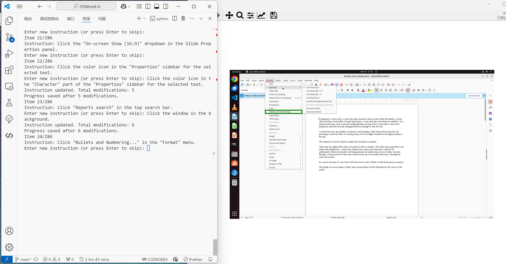

# OSWORLD-G

## Instruction Refinement of OSWorld-G

First, run `clear_referred_reformat.py` to get `annotations_v3_refined_{prompt_type}.json` to get annotation file with refiend instruction.

You can choose the refinement style here:

``` python
    asyncio.run(
        process_json(
            client,
            input_annotation_path,
            image_folder,
            instruction_folder,
            "component",  # TODO: select the instruction type you want to refine: "component" "baby"
        )
    )
```

We support 2 styles until now:

component: Describe the instruction in a clear, actionable way, using basic computer-use terminology.

baby: Describe the instruction in a extremely understandable way for anyone who doesn't have any computer-use experience.

Secondly, run `data_check.py` to manually check all instruction-image pair. Change the json_file_path before running this .py

```python
if __name__ == "__main__":
    json_file_path = "annotations_v3_refined_baby.json"  # TODO: change it to your annotation json file
    images_folder_path = "images"

    process_json_data(json_file_path, images_folder_path)
```

The checking process looks like this:



The terminal on the left shows the instruction of every piece of data. The image on the right show the corresponding image with a green bounding box.