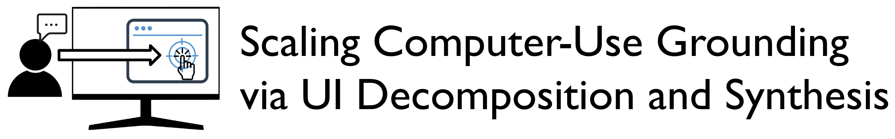

<p align="center">
  
</p>

<p align="center">
  <a href="https://osworld-grounding.github.io/">Website</a> •
  <!-- <a href="https://arxiv.org/abs/2404.07972">Paper</a> • -->
  <a href="https://huggingface.co/datasets/xlangai/Jedi">Dataset</a> •
  <a href="https://huggingface.co/xlangai/Jedi-3B-1080p">JeDi-3B</a> •
  <a href="https://huggingface.co/xlangai/Jedi-7B-1080p">JeDi-7B</a> •
</p>

<p align="center">
    <a href="https://img.shields.io/badge/PRs-Welcome-red">
        
    </a>
    <a href="https://img.shields.io/github/last-commit/xlang-ai/OSWorld-G?color=green">
        
    </a>
    <!-- <a href="https://opensource.org/licenses/Apache-2.0">
        
    </a> -->
    <!-- <a href="https://badge.fury.io/py/desktop-env">
        
    </a> -->
    <!-- <a href="https://pepy.tech/project/desktop-env">
        
    </a> -->
    <br/>
</p>

This is the official repository for "Scaling Computer-Use Grounding via UI Decomposition and Synthesis", which includes the benchmark--OSWorld-G and dataset pipeline--JeDi. We also provide links to the models (JeDi-3B, JeDi-7B) and dataset (JeDi) here.

## 📢 Updates
<!-- - 2025-05-04: Initial release of this README. -->

## 💾 Environment
First, clone this repository and `cd` into it. Then, install the dependencies listed in `requirements.txt`. We recommend using the latest version of Conda to manage the environment, but you can also choose to manually install the dependencies. Please ensure that Python version is >= 3.9.
```bash
# Clone the OSWorld-G(JeDi) repository
git clone https://github.com/xlang-ai/OSWorld-G.git

# Change directory into the cloned repository
cd OSWorld-G

conda create -n osworld-g python=3.9
conda activate osworld-g

# Install required dependencies
pip install -r requirements.txt
```

## 🤖 Model

We provide two JeDi models:
- [Jedi-3B](https://huggingface.co/xlangai/Jedi-3B-1080p)
- [Jedi-7B](https://huggingface.co/xlangai/Jedi-7B-1080p)

## 📊 Benchmark--OSWorld-G

We provide our OSWorld-G benchmark with original instructions (`benchmark/OSWorld-G.json`) and refined instructions (`benchmark/OSWorld-G_refined.json`) (pure grounding tasks that require minimal additional knowledge). The benchmark data and pipeline code are available in the `benchmark` folder, along with a series of evaluation scripts in the `evaluation` folder.

For instructions on running evaluations, please refer to the [Evaluation](#-evaluation) section and `README.md` in the `evaluation` folder.

## 🗄️ Dataset--JeDi

Our dataset is available at https://huggingface.co/datasets/xlangai/Jedi

In this repository, we provide the code for the data collection pipeline.

### Icon data

The pipeline code for icon data is provided in `dataset/icon`.

### Component data

#### Code-and-rendering pipeline

The complete code-and-rendering pipeline code is available in `dataset/component_render`.

#### Real-world augmentation pipeline

For the real-world augmentation pipeline, we provide code for document data, spreadsheet data, and presentation data in `dataset/component_handcraft`.

### Layout data

The code for layout data collection is provided in `dataset/layout`.

### Refusal data

The code for refusal data collection is provided in `dataset/refusal`.

## 🔍 Evaluation

We have provided a series of evaluation scripts in the `benchmark` folder for different models (JeDi, Aguvis, U-Ground, UI-Tars) and benchmarks (OSWorld-G, ScreenSpot-v2, ScreenSpot-Pro). You can easily extend these scripts to test additional model-benchmark combinations.

<!-- ## ❓ FAQ
TODO -->

## 📄 Citation
If you find this work useful, please consider citing our paper:
```
<!-- TODO -->
```